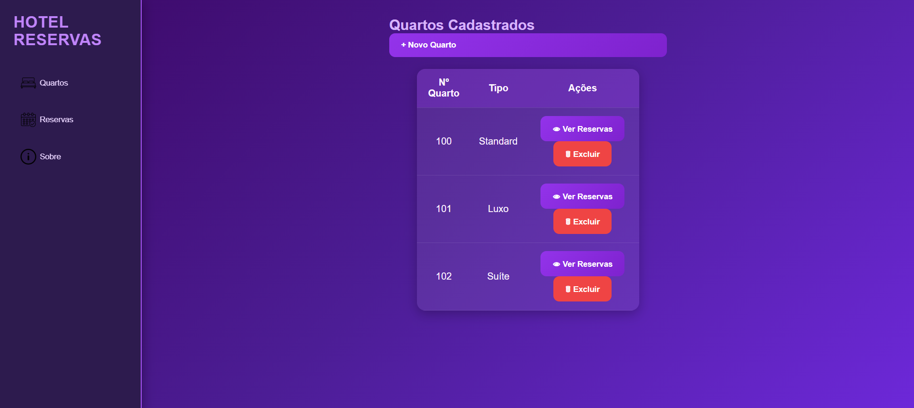
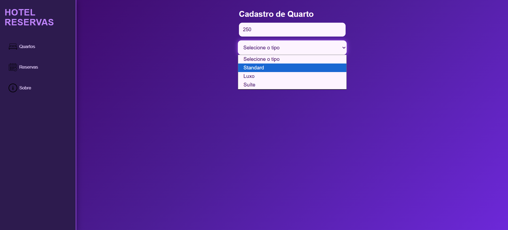
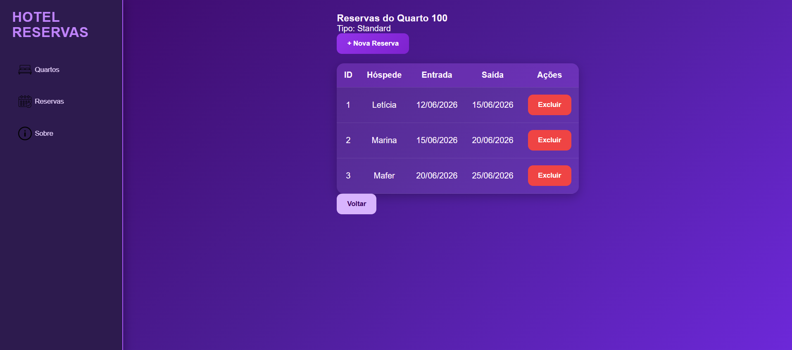
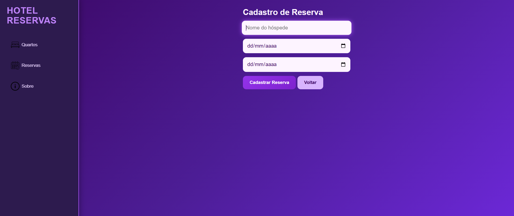
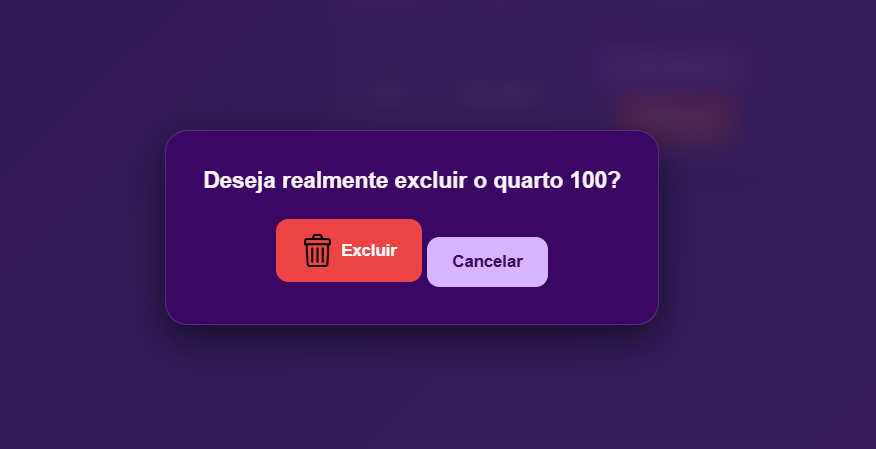
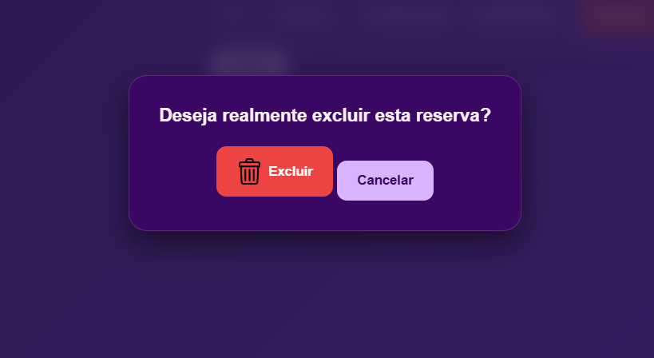

# Sistema Hotel Reservas

Sistema web full-stack para gerenciar quartos e reservas de um hotel, desenvolvido para a atividade de aprendizagem desafiadora.

##  Tecnologias Utilizadas
- **IDE:** Visual Studio Code (VS Code)
- **Front-end:** HTML5, CSS3 e JavaScript
- **Back-end:** Node.js / Express.js
- **ORM / Banco de Dados:** Prisma ORM com MySQL (`hotel_db`)
- **Testes de API:** Insomnia 

##  Modelo do Banco de Dados (Prisma Schema)

```prisma
generator client {
  provider = "prisma-client-js"
}

datasource db {
  provider = "mysql"
  url      = env("DATABASE_URL")
}

model Quartos {
  id       Int        @id @default(autoincrement())
  numero   String
  tipo     String
  reservas Reservas[]
}

model Reservas {
  id           Int      @id @default(autoincrement())
  hospede      String
  data_entrada DateTime
  data_saida   DateTime
  quartoId     Int
  quarto       Quartos  @relation(fields: [quartoId], references: [id], onDelete: Cascade)
}
```

---

## Como Executar o Projeto

Siga os passos abaixo no seu terminal para configurar o ambiente e rodar a aplicação:

1. **Configurar e Sincronizar as Tabelas no MySQL:**
   ```bash
   npx prisma migrate dev --name init
   ```

2. **Gerar o Cliente do Prisma ORM:**
   ```bash
   npx prisma generate
   ```

3. **Iniciar o Servidor Back-end (Modo Desenvolvimento):**
   ```bash
   npm run dev
   ```

4. **Abrir a Interface:**
   Abra o arquivo `index.html` diretamente no seu navegador web ou execute-o utilizando a extensão Live Server do VS Code.

---

## Demonstração Visual do Sistema (Prints das Telas)

*Abaixo estão os registros visuais de todas as interfaces e modais desenvolvidos para o fluxo de navegação do hotel:*

### 1. Tela Principal - Lista de Quartos



### 2. Cadastro de Quarto



### 3. Tela de Reservas do Quarto



### 4. Cadastro de Reserva



### 5. Confirmação de Exclusão de Quarto



### 6. Confirmação de Exclusão de Reserva



---
